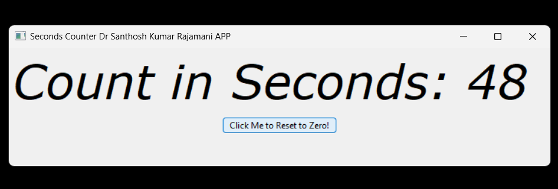
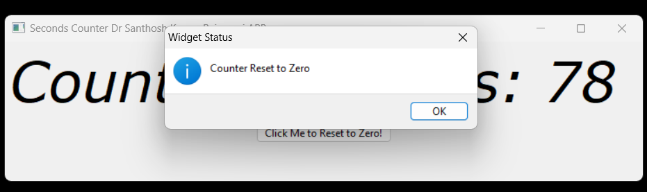

# Seconds Counter App

## Overview

This is a simple wxPython application that counts the number of seconds elapsed and displays it on the screen. The application includes a reset button to restart the counter from zero. 







[Download from Release Section](https://github.com/kephalian/Seconds-Counter/releases)


## Features

- Real-time seconds counter
- Button to reset the counter
- Simple and clean user interface
- Custom font for the counter display

## Requirements

- Python 3.x
- wxPython

## Installation

To run the application, you need to have Python and wxPython installed. You can install wxPython using pip:

```bash
pip install wxPython
```

## Usage

Clone the repository and run the Python script:

```bash
git clone https://github.com/yourusername/seconds-counter.git
cd seconds-counter
python seconds_counter.py
```

An executable file is also available for download in the `releases` section of this repository.

## Code

Here is a brief overview of the code:

```python
import wx
import threading
import time

tit='Seconds Counter Dr Santhosh Kumar Rajamani APP'

class MyFrame(wx.Frame):
    def __init__(self):
        super().__init__(parent=None, title=tit)
        self.InitUI()
        self.count = 0
        self.start_thread()

    def InitUI(self):
        panel = wx.Panel(self)
        sizer = wx.BoxSizer(wx.VERTICAL)
        self.label = wx.StaticText(panel, label="Count starting....", pos=(20, 20))
        sizer.Add(self.label, 0, wx.ALL | wx.EXPAND, 5)
        verdana_font = wx.Font(48, wx.FONTFAMILY_DEFAULT, wx.FONTSTYLE_ITALIC, wx.FONTWEIGHT_NORMAL, faceName="Verdana")
        self.label.SetFont(verdana_font)
        button1 = wx.Button(panel, label="Click Me to Reset to Zero!")
        button1.Bind(wx.EVT_BUTTON, self.on_button_click)
        sizer.Add(button1, 0, wx.ALL | wx.CENTER, 5)
        self.Center()
        panel.SetSizer(sizer)
        sizer.Fit(self)
        self.SetSize(750, 200)
        
    def on_button_click(self, event):
        wx.MessageBox("Counter Reset to Zero", "Widget Status", wx.OK | wx.ICON_INFORMATION)
        self.count = 0
        self.label.SetLabel("Count restarting....")
        
    def start_thread(self):
        thread = threading.Thread(target=self.update_label)
        thread.daemon = True
        thread.start()

    def update_label(self):
        while True:
            time.sleep(1)
            self.count += 1
            wx.CallAfter(self.update_label_safe)

    def update_label_safe(self):
        self.label.SetLabel(f"Count in Seconds: {self.count}")

class MyApp(wx.App):
    def OnInit(self):
        frame = MyFrame()
        frame.Show()
        return True

if __name__ == '__main__':
    app = MyApp()
    app.MainLoop()
```

## License

This project is licensed under the MIT License. See the [LICENSE](https://github.com/kephalian/Seconds-Counter/blob/main/license.txt) file for details.

## Download

You can download the executable file from the [releases](https://github.com/kephalian/Seconds-Counter/releases) Section 

## Contributing

Contributions are welcome! Please open an issue or submit a pull request.

## Author

[Dr. Santhosh Kumar Rajamani](https://github.com/kephalian)

